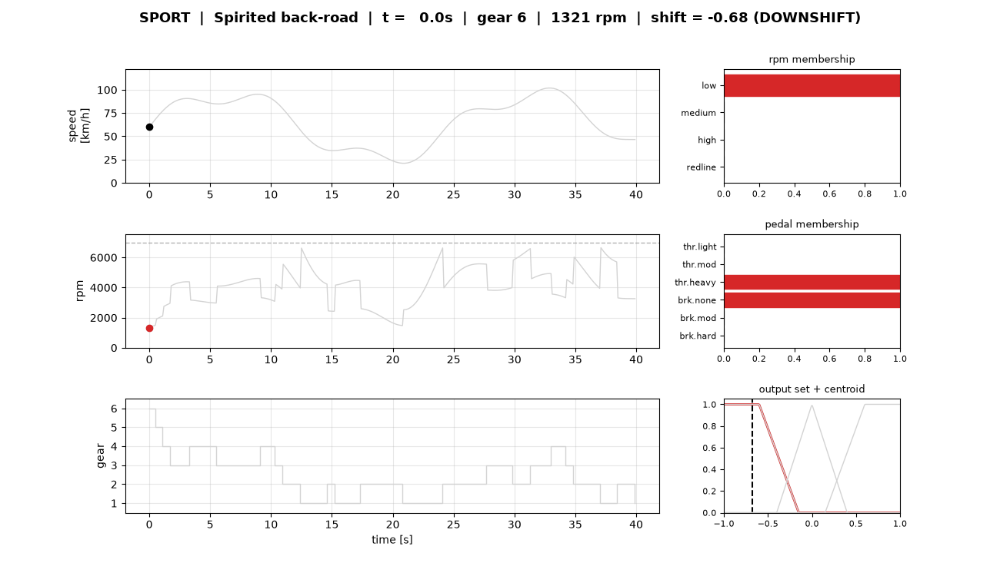
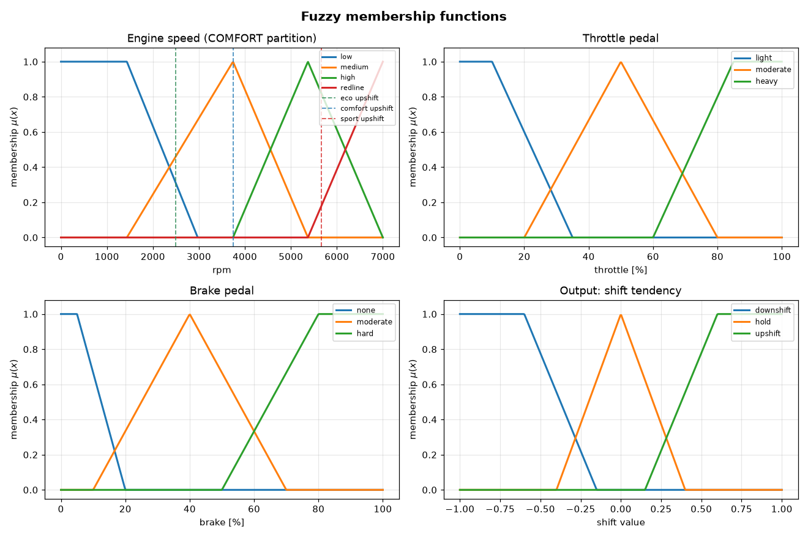
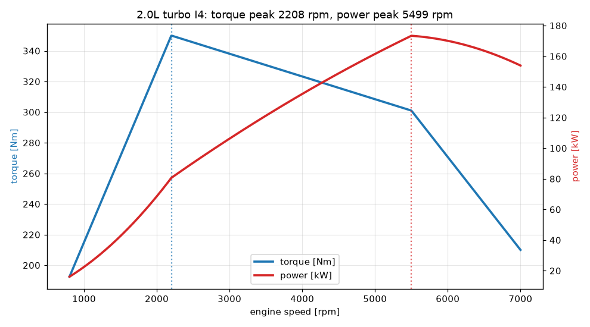
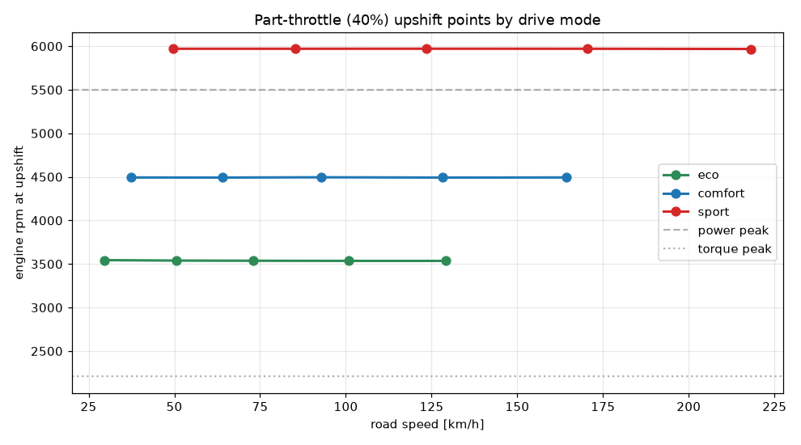
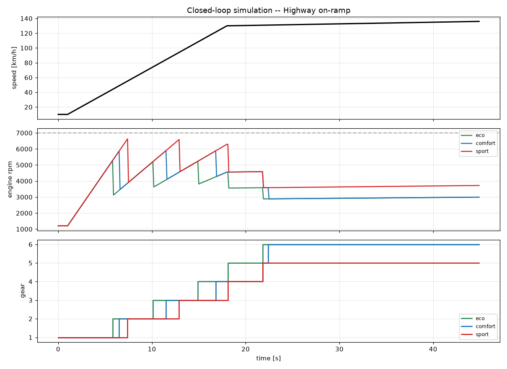

# Fuzzy Gear Controller

A **fuzzy-logic controller for automatic gear changing in a car**, written in
pure Python (NumPy + Matplotlib only). It decides — continuously and smoothly —
whether the gearbox should **shift up, hold, or shift down**, from the engine
rpm, the throttle and brake pedals, the road speed, a live *driving-style*
estimate, and a selectable **drive mode** (`eco` / `comfort` / `sport`).

The whole shift map is **elastic**: hand it a different engine torque curve and
gearset and every shift point re-anchors itself to *that* engine's torque peak,
power peak and redline.



*Live fuzzy inference on a spirited back-road run (SPORT mode): the time series
on the left, the instantaneous fuzzy memberships of rpm and the pedals on the
right, and the aggregated output set with its defuzzified centroid — the crisp
shift decision — at the bottom-right.*

---

## 1. What is fuzzy logic? (the 90-second version)

Classical (Boolean) logic is *crisp*: an engine speed of 2999 rpm is "not
high", 3001 rpm "is high". That hard edge is a poor model of how an engineer
actually reasons — *"the revs are getting fairly high, and the throttle is
light, so we can afford to upshift."*

**Fuzzy logic** (Zadeh, 1965) replaces the two-valued indicator function of a
set with a **membership function**

$$\mu_A : X \longrightarrow [0, 1],$$

where $\mu_A(x)$ is the *degree* to which $x$ belongs to the fuzzy set $A$. So
3000 rpm can be "0.7 medium and 0.3 high" simultaneously. A **fuzzy
controller** then reasons with human-readable **IF–THEN rules** over these
graded truths and collapses the result back to a single crisp number.

This project is a textbook **Mamdani inference system** (Mamdani & Assilian,
1975), the same structure used in commercial automatic-transmission shift logic:

```
 crisp inputs --> FUZZIFY --> RULE EVALUATION --> AGGREGATE --> DEFUZZIFY --> crisp output
   rpm, θ, β       μ(x)        min / max          ∪ (max)     centroid     shift ∈ [-1,1]
```

---

## 2. Fuzzification — membership functions

Each input is partitioned into overlapping fuzzy sets built from two primitives.
A **triangular** membership function with anchors $a \le b \le c$ is

$$
\mu_\triangle(x; a,b,c) =
\max\!\left(\min\!\left(\frac{x-a}{b-a},\, \frac{c-x}{c-b}\right),\, 0\right),
$$

and a **trapezoidal** one with $a \le b \le c \le d$ is

$$
\mu_\sqcap(x; a,b,c,d) =
\max\!\left(\min\!\left(\frac{x-a}{b-a},\, 1,\, \frac{d-x}{d-c}\right),\, 0\right).
$$

The controller's variables are:

| Variable | Universe | Fuzzy sets |
|---|---|---|
| Engine speed | $[0,\ \text{redline}]$ rpm | `low`, `medium`, `high`, `redline` |
| Throttle $\theta$ | $[0,100]\%$ | `light`, `moderate`, `heavy` |
| Brake $\beta$ | $[0,100]\%$ | `none`, `moderate`, `hard` |
| Road speed | $[0,200]$ km/h | `low`, `medium`, `high` |
| **Shift** (output) | $[-1,+1]$ | `downshift`, `hold`, `upshift` |



The rpm partition is the interesting one — see §5.

---

## 3. The rule base

Eleven linguistic rules encode the engineering intuition. With the **minimum**
t-norm for AND and the **maximum** t-conorm for OR, a rule's firing strength is
the min of its antecedent memberships. A representative subset:

```
R1  IF rpm is medium AND throttle is light  AND brake is none  THEN upshift
R2  IF rpm is high   AND throttle is light  AND brake is none  THEN upshift
R4  IF rpm is redline                                          THEN upshift     (over-rev guard)
R5  IF rpm is medium AND throttle is moderate                  THEN hold
R8  IF rpm is low    AND throttle is moderate                  THEN downshift   (lugging)
R9  IF rpm is low    AND throttle is heavy                     THEN downshift   (kickdown)
R11 IF brake is hard                                           THEN downshift   (engine braking)
```

Rule R4 is a pure **over-rev guard**: near the redline the box upshifts under
*any* throttle, so the engine bounces off the limiter instead of spinning past
it. Kickdown (R9) fires only at *low* rpm, where dropping a gear genuinely finds
power without risking an over-rev.

For a rule with antecedent clauses $A_1,\dots,A_k$ and consequent set $C$, the
firing strength is

$$
w = \min_i \mu_{A_i}(x_i), \qquad \text{and per output set } \quad
\alpha_C = \max_{\text{rules} \to C} w .
$$

---

## 4. Inference and defuzzification (centre of gravity)

Each consequent set is **clipped** at its firing strength $\alpha_C$ and the
clipped sets are unioned (max) into one aggregate membership function over the
output universe $S=[-1,1]$:

$$
\mu_{\text{agg}}(s) = \max_{C}\ \min\!\big(\alpha_C,\ \mu_C(s)\big).
$$

The crisp shift tendency is its **centroid** (centre of gravity) — the
defuzzification method used in classic transmission controllers because it
yields a smooth, interpretable output:

$$
s^\star = \frac{\displaystyle\int_{-1}^{1} s\,\mu_{\text{agg}}(s)\,\mathrm{d}s}
              {\displaystyle\int_{-1}^{1} \mu_{\text{agg}}(s)\,\mathrm{d}s}
\quad\approx\quad
\frac{\sum_j s_j\,\mu_{\text{agg}}(s_j)}{\sum_j \mu_{\text{agg}}(s_j)} .
$$

A thin state machine then turns $s^\star$ into discrete gears with hysteresis
(thresholds $\pm 0.33$), a minimum dwell time (so the box does not "hunt"), and
**over-rev protection** (a downshift that would exceed the redline is refused —
exactly as a real automatic blocks an unsafe kickdown).

---

## 5. Elasticity — engine-relative shift anchors

Nothing about a particular engine is hard-coded. An `EngineSpec` carries a
torque curve; from it the code derives the **torque-peak rpm**, the
**power-peak rpm** and the **redline**:



The rpm partition is then anchored to those landmarks. The light-throttle
upshift anchor for a mode $m$ and driving style $\sigma \in [0,1]$ is

$$
\text{up}(m,\sigma) = n_\tau + b_m\,(n_{\text{redline}} - n_\tau)
                     + \sigma\,g_m\,(n_{\text{redline}} - \text{up}),
$$

where $n_\tau$ is the torque-peak rpm and $b_m$ the mode's *up-blend*
($\approx 0.06$ eco, $0.32$ comfort, $0.72$ sport). Swap in a high-revving V8
and every anchor slides up automatically. The drive modes therefore produce
clean, speed-independent part-throttle shift points:



A driving-style estimate $\sigma$ — an exponentially weighted blend of recent
throttle and brake use — pushes the upshift anchor higher when you drive hard,
so the car *holds each gear longer* the more aggressively it is driven.

As an analytic yardstick, `optimal_power_gear()` returns the gear that maximises
available wheel power ($P/v$) at a given speed; SPORT mode tracks it closely.

---

## 6. Results

A full **closed-loop** simulation (rpm is recomputed from the engaged gear each
step, so an upshift visibly drops the revs) on a hard highway on-ramp, all three
modes overlaid:



Eco upshifts earliest (~5200 rpm), sport wrings each gear out to ~6600 rpm, and
all three settle into top gear at cruise — the qualitative signature of a real
adaptive gearbox. A second animated run is in
[`assets/dashboard_onramp.gif`](assets/dashboard_onramp.gif).

---

## 7. Quickstart

```bash
pip install -r requirements.txt

# regenerate the static figures
python demo_static.py

# render an animated dashboard (GIF)
python demo_animation.py --mode sport --cycle spirited --out assets/dashboard.gif

# run the synthetic test suite (pytest optional)
python tests/test_controller.py
```

Minimal API usage:

```python
from fuzzygear import FuzzyGearController, Inputs, Transmission

ctrl  = FuzzyGearController(mode="sport")
gearbox = Transmission(gear=3)

decision = ctrl.decide(Inputs(rpm=6200, throttle=15, brake=0, speed=110))
gear = gearbox.update(decision.shift_value, dt=0.1, speed_kmh=110)
print(decision.shift_value, gear)   # +0.7x  ->  upshift
```

---

## 8. Project layout

```
fuzzygear/
  membership.py   triangular / trapezoidal MFs and the AND/OR connectives
  engine.py       EngineSpec, Drivetrain, optimal_power_gear  (the elastic core)
  variables.py    linguistic variables; engine-relative rpm partition; drive modes
  controller.py   Mamdani inference + centroid defuzzification + transmission
  simulation.py   synthetic driving cycles and the closed-loop simulator
demo_static.py    generates the figures in assets/
demo_animation.py renders the animated dashboard GIF
tests/            synthetic behavioural tests
scripts/publish.py  token-based publishing (token read from the environment only)
```

---

## 9. References

- L. A. Zadeh, *Fuzzy Sets*, Information and Control, 1965.
- E. H. Mamdani & S. Assilian, *An experiment in linguistic synthesis with a
  fuzzy logic controller*, Int. J. Man-Machine Studies, 1975.
- Classic patents on fuzzy automatic-transmission shift control (e.g.
  US 4,841,815) use exactly this fuzzify → rules → centroid pipeline.
